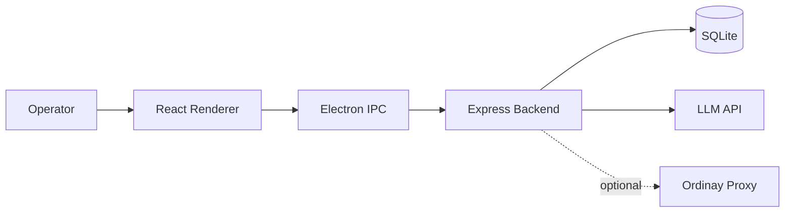

# lawyer-app

Law office management application with:

- Electron desktop frontend (`frontend`)
- Node/Express backend (`backend`)
- Optional proxy service (`ordinay-proxy`)

## Requirements

- Node.js 20.19+ or 22.12+
- npm 10+

## Quick Start

1. Install dependencies:

```bash
npm ci
npm --prefix backend ci
npm --prefix frontend ci
npm --prefix ordinay-proxy ci
```

2. Backend env setup:

```bash
cp backend/.env.example backend/.env
```

3. Frontend env setup (optional overrides):

```bash
cp frontend/.env.example frontend/.env
```

4. Start backend:

```bash
npm --prefix backend run start
```

5. Start frontend (dev mode):

```bash
npm --prefix frontend run electron:dev
```

## Build

Frontend desktop package:

```bash
npm --prefix frontend run electron:build
```

Proxy build:

```bash
npm --prefix ordinay-proxy run build
```

## Repository Layout

- `backend/` API server and domain logic
- `frontend/` Electron + React application
- `ordinay-proxy/` optional secured proxy
- `docs/` architecture, domain, and use-case documentation

## Architecture Vision Pack

For engineering and recruiter review, start with:

1. `docs/PROJECT_VISION.md` (product + architecture rationale)
2. `docs/ARCHITECTURE_DIAGRAMS.md` (system, runtime, and safety flow diagrams)
3. `docs/APP_LOGIC_USE_CASES.md` (core business flows and logic checkpoints)
4. `docs/DOMAIN_MODEL.md` (entity relationships and invariants)
5. `docs/ARCHITECTURE.md` (deep technical notes)

High-level system map:



## License

MIT. See `LICENSE`.
