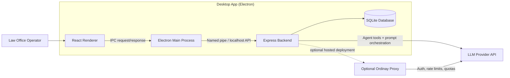
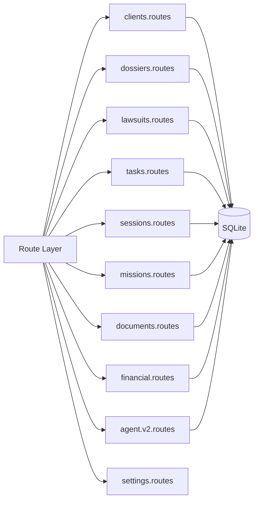
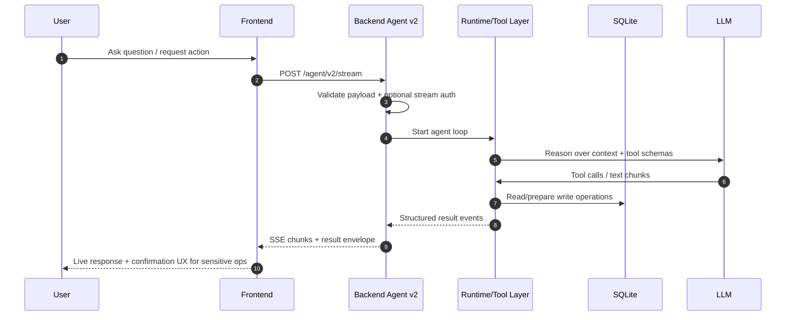
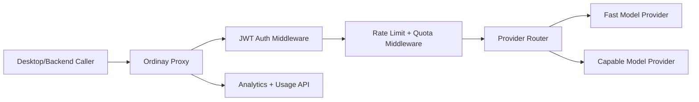

# Architecture Diagrams

## 1. System Context



## 2. Runtime Transport Logic

```mermaid
flowchart TD
    A["Renderer CRUD Request"] --> B{"Electron runtime?"}
    B -->|Yes| C["IPC: window.electronAPI.apiRequest"]
    C --> D["Main process proxyApiRequest"]
    D --> E["Backend /api/* routes"]

    B -->|No (web/fallback)| F["HTTP fetch to configured API base"]
    F --> E

    G["Agent streaming request"] --> H["Direct HTTP/SSE to /agent/v2/stream"]
    H --> E
```

## 3. Backend Domain Modules



## 4. Agent V2 Safety Flow



## 5. Optional Proxy Topology



## 6. Architecture Notes

- CRUD traffic is optimized for local reliability (IPC + local backend path).
- Streaming keeps direct HTTP/SSE to preserve event flow characteristics.
- Core legal logic stays in backend/domain routes, not in UI components.
- Database constraints enforce relationship correctness even if UI validation is bypassed.
